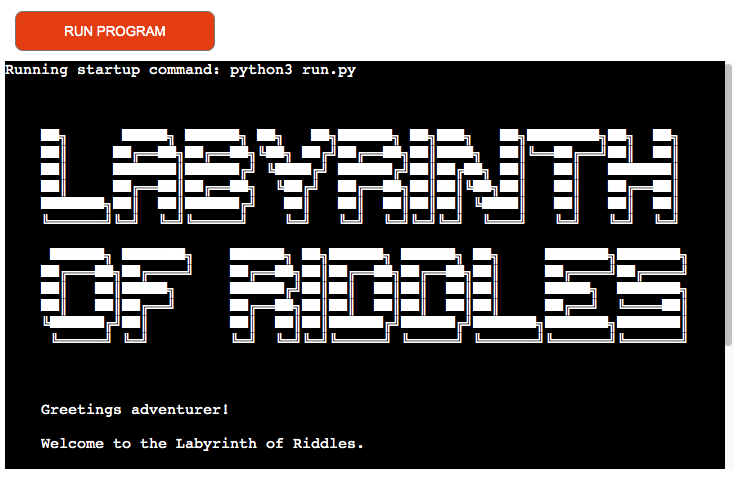

# **_The Labyrinth of Riddles_**

The Labyrinth of Riddles is a terminal game which a user can interact with via the Code Institute mock terminal on Heroku.

The target audience is anyone interested in text and puzzle based computer games. The audience will mainly include teens and above, men and women. Also anyone that has an interest in riddles and word games.

The goal of this online program is to provide a fun and interactive role-playing game where users can test their puzzle solving skills for entertainment purposes.

Navigating the game should be easy and intuitive for all users. The puzzle content should be challenging but well balanced for a diverse audience. Text should be well displayed and easy to read. The narrative should be coherent and engaging to encourage users to continue to progress through the game.

Link to the live site - [The Labyrinth of Riddles](https://labyrinth-of-riddles.herokuapp.com/)

# Contents

* [**User Experience UX**](<#user-experience-ux>)
    * [User Stories](<#user-stories>)
    * [Structure](<#structure>)
    * [Typography](<#typography>)
* [**Features**](<#features>)
    * [**Existing Features**](<#existing-features>)
        * [Title](<#title>)
        * [Storyboard](<#storyboard>)
        * [Riddles](<#riddles>)
        * [Labyrinth Structure](<#labyrinth-structure>)
        * [Typewriter Effect](<#typewriter-effect>)
        * [Input Validation](<#input-validation>)
        * [Chapter Functions](<#chapter-functions>) 
        * [Riddle Me This Function](<#riddle-me-this-function>) 
        * [Door Riddle Function](<#door-riddle>)       
        * [Play Again Function](<#play-again-function>) 
        * [Exit Function](<#exit-function>) 
        * [Go Back Function](<#go-back-function>) 
        * [You Die Function](<#play-again-function>) 
        * [End Function](<#end-function>) 
        * [Multiple Endings](<#multiple-endings>) 
    * [**Future Features**](<#future-features>)
* [**Technologies Used**](<#technologies-used>)
* [**Testing**](<#testing>)
     * [**Validator Tests**](<#validator-tests>)
     * [**Terminal Tests**](<#terminal-tests>)
     * [**Input Validation Tests**](<#input-validation-tests>)
     * [**Bugs**](<#bugs>)
        * [Resolved](<#resolved>)
        * [Unresolved](<#unresolved>)
* [**Deployment**](<#deployment>)
     * [**Project Deployment Via Heroku**](<#project-deployment-via-heroku>)
* [**Credits**](<#credits>)
    * [**Content**](<#content>)
    * [**Media**](<#media>)
    * [**Code**](<#code>)
*  [**Acknowledgements**](<#acknowledgements>)

# User Experience UX

## User Stories

* As a user I want to be able to understand the purpose and intention of the program when it first starts.
* As a user I want to be given the option to start or end the program with my first interaction.
* As a user I want the program navigation to be intuitive and easy to understand.
* As a user I want to be given the opportunity to exit the program frequently and easily.
* As a user I want to be warned that I will lose my progress if I exit the program and be given the opportunity to go back if I change my mind.
* As a user I want my input to be validated and error checked so I can re-enter my choice if it is invalid.
* As a user I want the storyline and narrative to be coherent, engaging and well structured.
* As a user I want the text to be well laid out and easy to read.
* As a user I want the puzzles and riddles to be challenging but well balanced.
* As a user I want to have three guesses at each riddle before losing the game.
* As a user I want a change in typography to help me differentiate between normal text and important sections.
* As a user to be given the option to play again if I win or lose.
* As a user I want different endings and outcomes based on my choices.
* As a user I want to be able to go back to a previous junction if I face a dead end in the labyrinth.
* As a user I want to be presented with multiple choices throughout the game that allow me to choose my own path.

[Back to top](<#contents>)

## Structure 

The Labyrinth of Riddles is structured using various loops and functions to allow a user to navigate through a digital labyrinth with text based commands. The program is purely text based and the user is unaware of the structure of the labyrinth while playing. Each choice presented to the user displays the options and text based input required to make that option. The user progresses through the labyrinth linearly and will only complete the labyrinth if they make all the correct navigational and riddle choices. If a user finds a dead end they are given the option to return to the previous junction. If a user character dies the user is given the option to return to the beginning of the labyrinth to start again.

[Back to top](<#contents>)

## Typography 

Because The Labyrinth of Riddles is a terminal program, style and design options are very limited. Font type and colour is default to the terminal but escape codes are used when printing the riddle elements to the terminal to make them more eye-catching to the user. The riddle dictionary items all contain bold (\033[1m) and italic (\x1B[3m) escape commands as well as the closing codes at the end of each riddle (\x1B[0m) and (\033[0m) to ensure the subsequent text isn't also affected.

[Back to top](<#contents>)

# Features

The Labyrinth of Riddles contains many features which help to enhance the users overall experience. Back-end functionality and interactivity are integral to a positive user experience within the limitations of this terminal-based project.

## Existing Features

### Title

[Back to top](<#contents>)

### Storyboard

[Back to top](<#contents>)

### Riddles

[Back to top](<#contents>)

### Labyrinth Structure

[Back to top](<#contents>)

### Typewriter Effect

[Back to top](<#contents>)

### Input Validation

[Back to top](<#contents>)

### Chapter Functions

[Back to top](<#contents>)

### Riddle Me This Function

[Back to top](<#contents>)

### Door Riddle Function

[Back to top](<#contents>)

### Play Again Function

[Back to top](<#contents>)

### Exit Function

[Back to top](<#contents>)

### Go Back Function

[Back to top](<#contents>)

### You Die Function

[Back to top](<#contents>)

### End Function

[Back to top](<#contents>)

### Multiple Endings

[Back to top](<#contents>)

## Future Features

[Back to top](<#contents>)

# Technologies Used

* Python
* Heroku
* [GitPod](https://gitpod.io/) - An open source developer platform for remote development. Used to edit and build the site
* [GitHub](https://github.com/) - An online host for web and software development projects. Used to store the repository and deploy the finished website.
* [Git](https://git-scm.com/) - Software for tracking changes to files. Used with GitPod to add, commit and push code changes to the repository on GitHub. 
* [Apple Notes](https://www.icloud.com/notes) - A simple Apple app used to write and plan copy and content for the website.
* [Slack](https://www.icloud.com/notes) - An online messaging program designed for workplace collaboration. Used for advice and guidance from peers and tutors. 

[Back to top](<#contents>)

# Testing

## Validator Tests

[Back to top](<#contents>)

## Terminal Tests

[Back to top](<#contents>)

## Input Validation Tests

[Back to top](<#contents>)

## Bugs

### Resolved 

[Back to top](<#contents>)

### Unresolved

[Back to top](<#contents>)

# Deployment

## Project Deployment via Heroku

[Back to top](<#contents>)

# Credits

## Content

[Back to top](<#contents>)

## Media

[Back to top](<#contents>)

## Code 

[Back to top](<#contents>)

# Acknowledgements

[Back to top](<#contents>)

