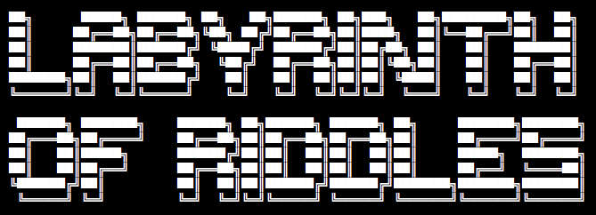
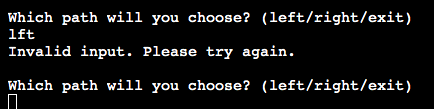
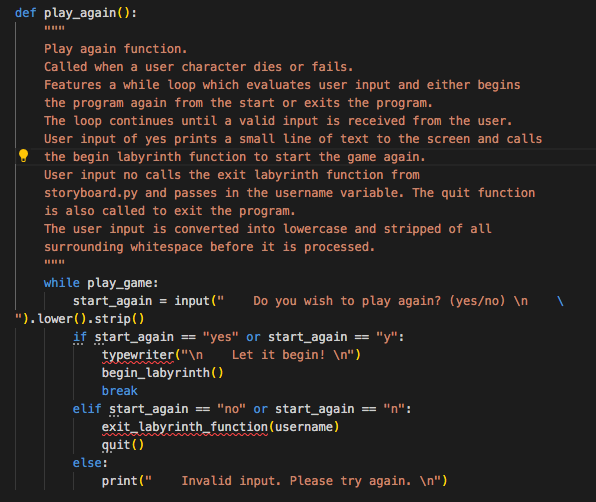
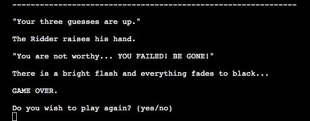
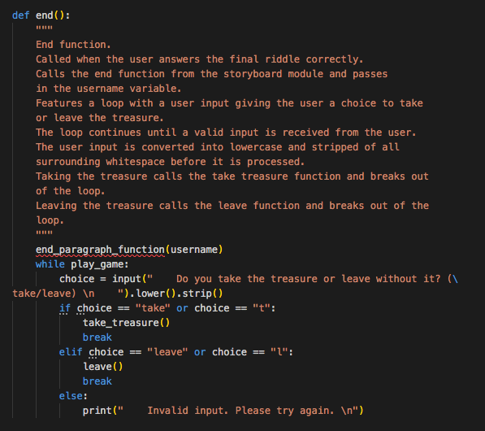

# **_The Labyrinth of Riddles_**

The Labyrinth of Riddles is a terminal game which a user can interact with via the Code Institute mock terminal on Heroku.

The target audience is anyone interested in text and puzzle based computer games. The audience will mainly include teens and above, men and women. Also anyone that has an interest in riddles and word games.

The goal of this online program is to provide a fun and interactive role-playing game where users can test their puzzle solving skills for entertainment purposes.

Navigating the game should be easy and intuitive for all users. The puzzle content should be challenging but well balanced for a diverse audience. Text should be well displayed and easy to read. The narrative should be coherent and engaging to encourage users to continue to progress through the game.

Link to the live site - [The Labyrinth of Riddles](https://labyrinth-of-riddles.herokuapp.com/)

# Contents

* [**User Experience UX**](<#user-experience-ux>)
    * [User Stories](<#user-stories>)
    * [Structure](<#structure>)
    * [Typography](<#typography>)
* [**Features**](<#features>)
    * [**Existing Features**](<#existing-features>)
        * [Title](<#title>)
        * [Storyboard](<#storyboard>)
        * [Riddles](<#riddles>)
        * [Labyrinth Structure](<#labyrinth-structure>)
        * [Typewriter Effect](<#typewriter-effect>)
        * [Input Validation](<#input-validation>)
        * [Chapter Functions](<#chapter-functions>) 
        * [Riddle Functions](<#riddle-functions>) 
        * [Riddle Me This Function](<#riddle-me-this-function>) 
        * [Door Riddle Function](<#door-riddle>)       
        * [Play Again Function](<#play-again-function>) 
        * [Exit Function](<#exit-function>) 
        * [Go Back Function](<#go-back-function>) 
        * [You Die Function](<#play-again-function>) 
        * [End Function](<#end-function>) 
        * [Multiple Endings](<#multiple-endings>) 
    * [**Future Features**](<#future-features>)
* [**Technologies Used**](<#technologies-used>)
* [**Testing**](<#testing>)
     * [**Validator Tests**](<#validator-tests>)
     * [**Terminal Tests**](<#terminal-tests>)
     * [**Input Validation Tests**](<#input-validation-tests>)
     * [**Bugs**](<#bugs>)
        * [Resolved](<#resolved>)
        * [Unresolved](<#unresolved>)
* [**Deployment**](<#deployment>)
     * [**Project Deployment Via Heroku**](<#project-deployment-via-heroku>)
* [**Credits**](<#credits>)
    * [**Content**](<#content>)
    * [**Media**](<#media>)
    * [**Code**](<#code>)
*  [**Acknowledgements**](<#acknowledgements>)

# User Experience UX

## User Stories

* As a user I want to be able to understand the purpose and intention of the program when it first starts.
* As a user I want to be given the option to start or end the program with my first interaction.
* As a user I want the program navigation to be intuitive and easy to understand.
* As a user I want to be given the opportunity to exit the program frequently and easily.
* As a user I want to be warned that I will lose my progress if I exit the program and be given the opportunity to go back if I change my mind.
* As a user I want my input to be validated and error checked so I can re-enter my choice if it is invalid.
* As a user I want the storyline and narrative to be coherent, engaging and well structured.
* As a user I want the text to be well laid out and easy to read.
* As a user I want the puzzles and riddles to be challenging but well balanced.
* As a user I want to have three guesses at each riddle before losing the game.
* As a user I want a change in typography to help me differentiate between normal text and important sections.
* As a user to be given the option to play again if I win or lose.
* As a user I want different endings and outcomes based on my choices.
* As a user I want to be able to go back to a previous junction if I face a dead end in the labyrinth.
* As a user I want to be presented with multiple choices throughout the game that allow me to choose my own path.

[Back to top](<#contents>)

## Structure 

The Labyrinth of Riddles is structured using various loops and functions to allow a user to navigate through a digital labyrinth with text based commands. The program is purely text based and the user is unaware of the structure of the labyrinth while playing. Each choice presented to the user displays the options and text based input required to make that option. The user progresses through the labyrinth linearly and can only complete the labyrinth if they make all the correct navigational and riddle choices. If a user finds a dead end they are given the option to return to the previous junction. If a user character dies the user is given the option to return to the beginning of the labyrinth to start again. An option to exit the labyrinth/program is presented as an alternative option to the user with each choice they make.

[Back to top](<#contents>)

## Typography 

Because The Labyrinth of Riddles is a terminal program, style and design options are very limited. Font type and colour is default to the terminal but escape codes are used when printing the riddle elements to the terminal to make them more eye-catching to the user. The riddle dictionary items all contain bold (\033[1m) and italic (\x1B[3m) escape commands as well as the closing codes at the end of each riddle (\x1B[0m) and (\033[0m) to ensure the subsequent text isn't also affected.

[Back to top](<#contents>)

# Features

The Labyrinth of Riddles contains many features which help to enhance the users overall experience. Back-end functionality and interactivity are integral to a positive user experience within the limitations of this terminal-based project.

## Existing Features

### Title

The title for The Labyrinth of Riddles is the first element displayed in the terminal when the program begins. It is ASCII word art generated using an online program called [Patorjk](http://patorjk.com/software/taag/#p=display&f=ANSI%20Shadow&t=The%20Labyrinth%20%0Aof%20Riddles). The font style is called ANSI Shadow. The title is saved into a separate python module called title.py and saved into a variable called title_art. The title module is imported into the run.py file and the title variable is printed to the terminal from the run.py module. Although styling is limited within the terminal, word art is used to work within those limitations to provide a basic yet eye catching beginning to the program. 

[Back to top](<#contents>)

### Storyboard

The large paragraphs of text required for the storyboard are saved into variables in a seperate python module called storyboard.py. This helps to avoid unnecessary clutter in the run.py main python module. The storyboard variables consist of multi-line strings defined by the triple quotation marks opening and closing syntax. This allows for all indentation and paragraphing to remain easily editable and consistent. The storyboard.py module is imported into the run.py file along with all its contents. All storyboard variables are printed to the terminal using the typewriter function from the run.py file. Variables are printed in the relevant chapters in the story as the user progresses through the labyrinth. The story is all original but elements are inspired by the [Labyrinth](https://www.imdb.com/title/tt0091369/) movie. Text content is written to engage the user in the storyline with fantasy role playing elements. The user charater is kept gender neutral to not alienate any audience interested in playing.

[Back to top](<#contents>)

### Riddles

The riddles used throughout the program are saved into a separate python module called riddles.py. These riddles are saved into a variable called riddle which contains a list of dictionaries. Each dictionary contains a riddle with the key of riddle and a riddle answer with the key of correct. The riddle list of dictionaries is imported into the run.py module so it can be used in the program. The riddle elements of the dictionaries also contain opening and closing escape codes for bold and italicized text. They also contain escape characters for line breaks. There are six riddles with corresponding correct answers saved into the riddle list of dictionaries. Riddles are then accessed and printed to the terminal using the typewriter effect from the run.py file in the riddle me this function. 

[Back to top](<#contents>)

### Labyrinth Structure

The Labyrinth of Riddles maze structure is based off of an image found online at [Difference Between](http://www.differencebetween.info/difference-between-maze-and-labyrinth). The use of an image for the maze structure greatly helped with the planning stage of the labyrinth. Navigational choices throughout the Labyrinth of Riddles follow the structure of the maze image. Dead ends either lead to characters deaths or the opportunity to go back to the previous junction. Each correct navigational choice leads to another riddle and progression to the next chapter.

[Back to top](<#contents>)

### Typewriter Effect

A typewriter effect is used to add a minor animation effect to large blocks of text. This provides a more interesting experience for the user and also helps the user to differentiate new text elements from previous paragraphs. It also provides a time delay between printing each character to roughly similate a users reading speed. The typewriter function is defined in the run.py python module. The function is passed variables containing strings as an argument and uses a loop to print each character within the string with a slight time delay. To enable this functionality, run.py imports sys (system), and sleep from the time module at the beginning of the program. Text is then printed to the terminal using the typewriter effect by passing in a storyboard text variable in the appropriate chapter or section of the program.

[Back to top](<#contents>)

### Input Validation

Input validation is a very crucial element in the functionality of the Labyrinth of Riddles. All user inputs are strings which are removed of any capitalisation and stripped of any spaces before being processed. This is done using the .lower() and .strip() inbuilt python functions. User inputs for navigational choices are evaluated using an if/elif/else statement inside a while loop. A user is presented with a list of input options when they are prompted to make a choice of two or more options. The if statement then checks for valid user text input, and if a string in the if/elif statement matches a user input the user is directed to the next function and the break statement is used to break out of the loop. If no matches to the user input are found the else statement is activated and "Invalid input. Please try again." is printed to the terminal. The loop then returns to the beginning with the prompt for the user to make a choice. This loop continues until a valid input from the user is entered. User inputs for riddles are validated slightly differently. A while loop and if/elif/else statements are still used in the riddle me this function but any invalid input will be processed as incorrect and will decrease the users number of available guesses by one. If this wasn't processed differently the user would have unlimited guesses for each riddle and then the game wouldn't be as challenging. User input for the riddles is compared against the correct key value in the riddle dictionary and also the alternative answer passed into the riddle me this function from the previous function. A matching answer to either of these passes the user to the next chapter and breaks the user out of the loop. The user is also given the option to exit the program. All navigational choices can also be made by simply typing the first letter of the word. 

[Back to top](<#contents>)

### Chapter Functions

There are five chapter functions which are defined in the run.py module. The functions are normally called after a user makes a correct riddle choice. Chapter functions begin by using the typewriter effect to print one or more  variables from the storyboard module to the terminal. The user is then presented with a navigational choice which is a if/elif/else statement wrapped in a while loop. A valid user choice breaks the user out of the loop and calls the next function. The user is also given the option to exit the labyrinth/program at each navigational choice.

[Back to top](<#contents>)

### Riddle Functions

There are six riddles and six riddle functions in the Labyrinth of Riddles. The riddle functions are usually called by making a correct navigational choice. The main purpose of the riddle functions is to assign new riddle variables and then call and pass the riddle me this function the variables as arguments. They are also used to print storyboard text elements to the terminal. Variables assigned with the riddle functions are the riddle question dictionary location, the riddle answer dictionary location, the next path which calls the function that the user navigates to when the riddle is answered correctly and an alternative answer to the riddle.

[Back to top](<#contents>)

### Riddle Me This Function

The riddle me this function is the function used for each riddle section of the program. It is passed four arguments from the riddle functions - riddle_question, riddle_answer, next_path and alt_answer. The function is defined in the run.py module. The function first loops through the riddle_question string from the assigned riddle dictionary and uses the typewriter effect to print each character individually to the terminal. Then a variable called guesses is assigned the value of 3. A while loop is then defined which prints the users number of available guesses assigned to the guesses variable to the terminal. The user is also reminded that they can exit the labyrinth/program by typing "exit" into the input. The user is then prompted to make a guess at the answer to the riddle with an input. An if/elif/else statement is then defined to check if the user input matches a number of different answers. If the user choice matches the riddle_answer or alt_answer variables the user is correct and the break statement is used to break the user out of the loop. The next_path variable function is also called to send the user to the next function. The user input is also tested for the exit command which triggers the exit function. If the user input that doesn't match either the if or elif options the else statement is triggered and the guesses variable is decreased by the value of 1. Another if/else statement is then defined to check if the guesses variable is equal to zero. If the guesses variable is equal to zero this means the user has run out of guesses and the you_die function is called along with a break statement. Otherwise the user is advised that they guessed incorrectly and the loop repeats. 

[Back to top](<#contents>)

### Door Riddle Function

The door riddle function is a larger function which features multiple nested if/elif/else statements. The purpose of this function is to provide the user with a new interesting challenge, which the user interacts with slightly differently in comparison to the riddle functions. The door riddle is based on a famous riddle which features in the [Labyrinth](https://www.imdb.com/title/tt0091369/) movie. First an available_questions variable is assigned the value of 1. Then a while loop is defined which checks if the value of the available_questions variable is 1. If it is the user is given the choice of whether to choose a door, ask a question, or exit the labyrinth/program. If the user chooses the door option they are given a choice of the left or right door. Choosing the left door is the correct option and breaks the loop and calls the fourth_riddle function. Choosing the right door calls the right_door function and also breaks the loop. Invalid input from the user repeats the door option loop until the user enters a valid option. If the user chooses the ask option instead of door the storyboard variable which_question is printed using the typewriter effect to the terminal which displays four question options to ask. Another while loop is defined with a user input asking the user which question they would like to ask. An if/elif/else statement is then defined to check user input to match with one of the four questions. If user input doesn't match the loop repeats itself until a valid input is obtained. If a valid input is entered by the user the answer to the matching question is printed to the terminal and the available_questions variable is decreased by the value of 1 making it 0. The nested loop is then broken out of using the break statement and the user is returned to the orginal loop. The value of the variable available_questions is tested, and if it does not equal 1 the user is then sent directly to the else statement which prompts the user to pick a door without the option to ask a question as they have already asked their one question. This else statement features another nested if/elif/else statement which functions exactly the same as if the user decided to choose a door before asking a question. 

[Back to top](<#contents>)

### Play Again Function

The play again function is defined on the run.py module. It is called when a player character dies or runs out of guesses on a riddle. The purpose of this function is to give the user an option to restart the game or quit the program. The function features a while loop which displays the question to the user of whether they would like to play again or not. The while loop contains an if/elif/else statement which checks the users input and either calls the begin_labyrinth function and breaks out of the loop, prints a goodbye message and calls the quit function or displays an invalid input message and repeats the loop. The loop repeats until a valid input is received from the user.

[Back to top](<#contents>)

### Exit Function

The exit function is called whenever a user enters the exit command into the terminal input. The purpose of this function is to provide the user with a visual reminder that they will lose their progress if they exit. The user is then given an opportunity to confirm their choice or return back to their previous position in the game. The function features a while loop with a nested if/elif/else statement. Confirming the exit will print a small goodbye message and quit the program. Invalid input will print a small invalid input message to the terminal and repeat the loop. If the user decides to return back the break statement is used to break out of the while loop and return to the previous function.

[Back to top](<#contents>)

### Go Back 

The go back function is called when a user reaches a dead end in the labyrinth. The purpose of this function is to give the user the choice to return back to their previous junction or exit the program/labyrinth. The function features a while loop with a nested if/elif/else statement. The user is asked whether they wish to return back or exit the labyrinth. Their input is processed and checked for a match against the two options and if no match is found an invalid input statement is printed to the terminal and the loop repeats until a valid user input is received. If the user chooses to go back, a small section of text is printed using the typewriter effect to the terminal and the loop is broken out of using the break statement. This returns the user to the previous function loop choice. If the user chooses to exit the program the exit function is called.

[Back to top](<#contents>)

### You Die Function

[Back to top](<#contents>)

### End Function

[Back to top](<#contents>)

### Multiple Endings

[Back to top](<#contents>)

## Future Features

[Back to top](<#contents>)

# Technologies Used

* Python
* Heroku
* [GitPod](https://gitpod.io/) - An open source developer platform for remote development. Used to edit and build the site
* [GitHub](https://github.com/) - An online host for web and software development projects. Used to store the repository and deploy the finished website.
* [Git](https://git-scm.com/) - Software for tracking changes to files. Used with GitPod to add, commit and push code changes to the repository on GitHub. 
* [Apple Notes](https://www.icloud.com/notes) - A simple Apple app used to write and plan copy and content for the website.
* [Slack](https://www.icloud.com/notes) - An online messaging program designed for workplace collaboration. Used for advice and guidance from peers and tutors. 

[Back to top](<#contents>)

# Testing

## Validator Tests

[Back to top](<#contents>)

## Terminal Tests

[Back to top](<#contents>)

## Input Validation Tests

[Back to top](<#contents>)

## Bugs

### Resolved 

[Back to top](<#contents>)

### Unresolved

[Back to top](<#contents>)

# Deployment

## Project Deployment via Heroku

[Back to top](<#contents>)

# Credits

## Content

STORYBOARD NARRATIVE - LABYRINTH
LABYRINTH STRUCTURE - 

[Back to top](<#contents>)

## Media

TITLE

[Back to top](<#contents>)

## Code 

TYPEWRITER EFFECT - STACK OVERFLOW - https://stackoverflow.com/questions/20302331/typing-effect-in-python

[Back to top](<#contents>)

# Acknowledgements

[Back to top](<#contents>)

